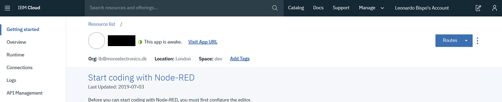
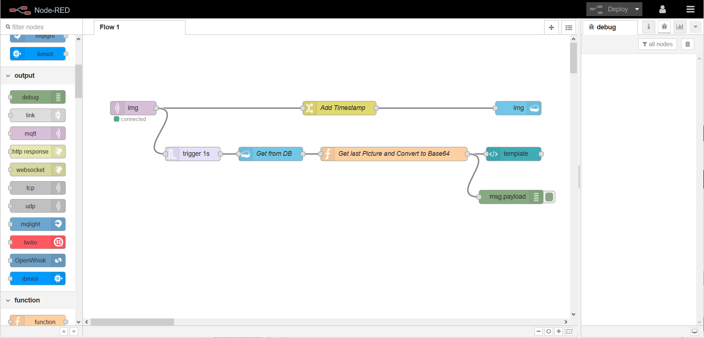
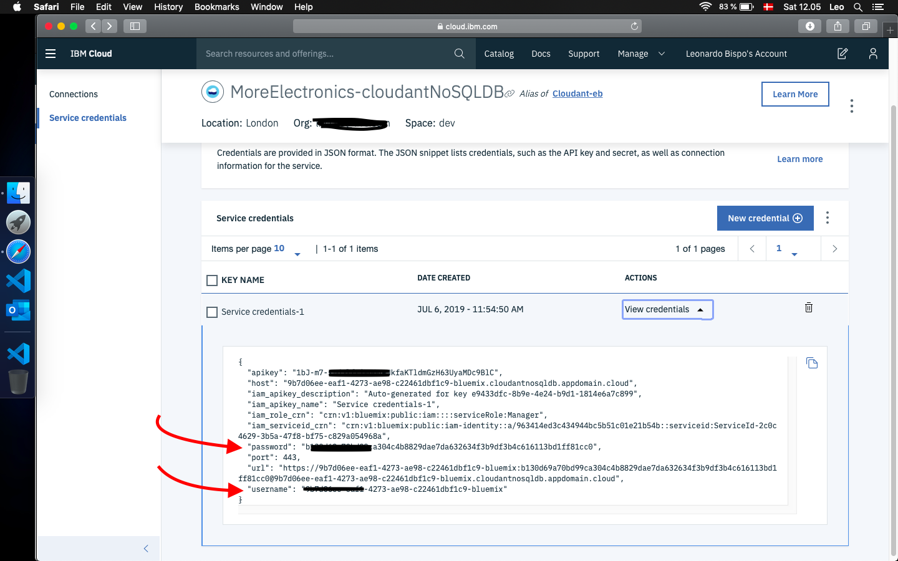

# ESP32-CAM-MQTT
ESP32-CAM remote image access via HTTP. Take pictures with ESP32 and upload it via MQTT making it accessible for the outisde network on Node_RED

## Limitations

* The MQTT buffer size is limited by the library, thus the max picture size `_client.space() == 5744` -> Play around with the resolution and find the suitable one `FRAMESIZE_QVGA`
  * https://github.com/marvinroger/async-mqtt-client/issues/74

## Sumary

1. [PlatformIO](/README.md#PlatformIO)
2. [Flashing](/README.md#Flashing)
3. [Hardware](/README.md#Hardware)
4. [MQTT Broker](/README.md#MQTT-Broker)
5. [IBM Node-RED Hosting](/README.md#IBM-Node-RED-Hosting)
6. [Node-RED Flow](/README.md#Node-RED-Flow)
7. [Credits](/README.md#Credits)

## PlatformIO

* More information can be found on their comprehensive [Docs](https://docs.platformio.org/en/latest/ide/vscode.html). But Basically:

  0. Download and install official Microsoft Visual Studio Code. PlatformIO IDE is built on top of it
  1. **Open** VSCode Package Manager
  2. **Search** for official `platformio-ide` [extension](https://marketplace.visualstudio.com/items?itemName=platformio.platformio-ide)
  3. **Install** PlatformIO IDE.

## Flashing

* ESP32-CAM does not have a built-in UART/USB converter, therefore you will need one.

  1. TX goes to RX;
  2. RX goes to TX;
  3. Power the board while keeping `GIPO0` low;
  4. You can now release it and upload your code;

 * image from [https://randomnerdtutorials.com/esp32-cam-troubleshooting-guide/](https://randomnerdtutorials.com/esp32-cam-troubleshooting-guide/)

## Hardware

### Board Pinout

### LDO

* This board has an [AMS1117](./extras/ds1117.pdf) voltage regulator which "sleep" current is around `6mA`, this is quite a lot if you plan to have your board running on batteries.
* **TODO!** find an alternative with the same package.

## MQTT Broker

The MQTT Broker used is [CloudMQTT](https://www.cloudmqtt.com/) they offer Free accounts 😉 that works just fine.

## IBM Node-RED Hosting

The process was a bit tedious and took a while to get it properly running as of today (2019/07/23) the information provided on the tutorial had few broken links.

[https://nodered.org/docs/platforms/bluemix](https://nodered.org/docs/platforms/bluemix)

1. Sign-up/Log in to [https://cloud.ibm.com/](https://cloud.ibm.com/);
2. Using the top search bar, search for `Node-RED Starter`;
3. Fill the required fields, `App name`, `Host name`, etc...
4. Select `Lite` for `SDK for Node.js` and `Cloudant`, those are free, you can upgrade later if required;
5. Click `Create` at the bottom right, the circle will spin, take few seconds;
6. You will be redirected to the next page and should see `running` when everything is ready for use:

7. Go to your App URL, something like [http://AppName.eu-gb.mybluemix.net](http://AppName.eu-gb.mybluemix.net) and complete the initial set-up;
8. The Node-Red GUI Flow Editor is available at [http://AppName.eu-gb.mybluemix.net/red](http://AppName.eu-gb.mybluemix.net/red)

* After installing the Node desbribed below, Your Node-red Dashboard is available at [http://AppName.eu-gb.mybluemix.net/ui](http://AppName.eu-gb.mybluemix.net/ui)

## Node-RED Flow

### Install required nodes

* Menu -> Manage Palette -> Install tab. You will need `node-red-dashboard`

### Import Node example

* Copy the flow below and import to your Nore-RED available at `yournode.eu-gb.mybluemix.net/red` Import -> Clipboard, paste it.

You will find the flow.json [here](./Node-RED%20flow/flows.json).

### Cloudant Credentials for cleaning database

* Generally Cloudant autheticate via IBM cloud therefore we need to create new Credentials and use the username and password for authentication on the `delete inputs on database` node.

## Node-RED Notification

* Via the `catch` node, you can enable notification, for your phone for example. Below I have quickly show few options:

1. Email

  * Use the `email` output, configured with your email provider info;

2. PushSafer

  * Offers several customizations, sound, vibration, icons, etc:
  * GET request url: `https://www.pushsafer.com/api?k=YOURKEY&c=%23ff0000&v=1&a=1&m={{payload}}`

5. Twilio SMS

  * SMS API, built-in to the Node-RED and IBM example;

6. IFTT

  * If this than that, with android and iOS apps can be accesible via webhooks;
  * GET `https://maker.ifttt.com/trigger/YOUR_EVENT/with/key/YOUR_KEY?value1=MESSAGE`

## Credits

GitHub Shields and Badges created with [Shields.io](https://github.com/badges/shields/)

GitHub ESP32 camera [example](https://github.com/espressif/arduino-esp32/tree/master/libraries/ESP32/examples/Camera/CameraWebServer)
