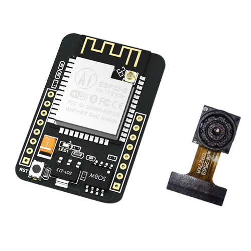
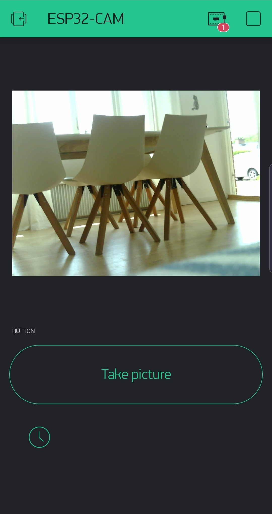
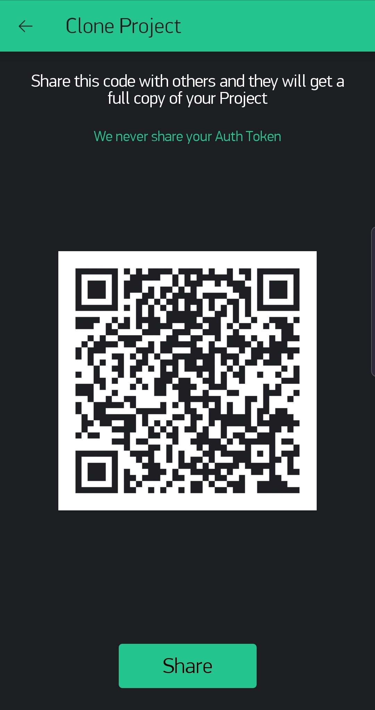

# ESP32-CAM-Picture-Sharing
ESP32-CAM remote image access via FTP. Take pictures with ESP32 and upload it via FTP making it accessible for the outisde network.

[](https://github.com/ldab/ESP32-CAM-Picture-Sharing/releases/latest)
[](https://travis-ci.org/ldab/ESP32-CAM-Picture-Sharing)
[](https://github.com/ldab/ESP32-CAM-Picture-Sharing/blob/master/LICENSE)

[](https://github.com/ldab/ESP32-CAM-Picture-Sharing)

[](https://www.aliexpress.com/item/32963016501.html?spm=a2g0s.9042311.0.0.4acb4c4dqzOcdx)

## Sumary

1. [PlatformIO](/README.md#PlatformIO)
2. [Flashing](/README.md#Flashing)
3. [Hardware](/README.md#Hardware)
4. [Free Website Hosting](/README.md#Free-Website-Hosting)
5. [Blynk](/README.md#Blynk)
6. [Node-RED](/README.md#Node-RED)
7. [Credits](/README.md#Credits)

## PlatformIO

* More information can be found on their comprehensive [Docs](https://docs.platformio.org/en/latest/ide/vscode.html). But Basically:

  0. Download and install official Microsoft Visual Studio Code. PlatformIO IDE is built on top of it
  1. **Open** VSCode Package Manager
  2. **Search** for official `platformio-ide` [extension](https://marketplace.visualstudio.com/items?itemName=platformio.platformio-ide)
  3. **Install** PlatformIO IDE.


## Flashing

* ESP32-CAM does not have a built-in UART/USB converter, therefore you will need one.

  1. TX goes to RX;
  2. RX goes to TX;
  3. Power the board while keeping `GIPO0` low;
  4. You can now release it and upload your code;

[](https://randomnerdtutorials.com/esp32-cam-troubleshooting-guide/)
 * image from [https://randomnerdtutorials.com/esp32-cam-troubleshooting-guide/](https://randomnerdtutorials.com/esp32-cam-troubleshooting-guide/)

## Hardware

### Board Pinout


### LDO

* This board has an [AMS1117](./extras/ds1117.pdf) voltage regulator which "sleep" current is around `6mA`, this is quite a lot if you plan to have your board running on batteries.
* **TODO!** find an alternative with the same package.

## Free Website Hosting

* There're plenty of tutorials and examples on how to run the video streming or pictures on your local network while the ESP32 acts as a webserver.

* The idea behind this project is to `upload` the picture via FTP making it available on an URL something like: `www.mysite.com/my_picture.jpg`

* This way you don't need to overload the ESP32, your network remains secure, not open to the world, no port forwarding.

* For this example I uploaded the GitHub Octocat to my [000Webhost](https://www.000webhost.com/) hosted webiste, the file is avalable under: `https://my_user.000webhostapp.com/gallery_gen/XxXxXxXx.jpg`

```
  ftp.OpenConnection();

  // Create the new file and send the image
  ftp.InitFile("Type I");
  ftp.ChangeWorkDir("/public_html/zyro/gallery_gen/");
  ftp.NewFile("octocat.jpg");
  ftp.WriteData( octocat_pic, sizeof(octocat_pic) );
  ftp.CloseFile();

  ftp.CloseConnection();
```

### FTP information

* Your FTP details can be found on the 000webhost control panel once logged on click your site then details.


## Blynk App

* This is a Bonus, as you may want to add it to your altomation project, you can use `Blynk Image Gallery Widget` and just supply it with the URL used by ESP32 from the hardware.

```
// Take a picture and add a time tag to it;
take_picture( "my_picture_201906170521" );
upload_FTPpicture();

// And by changing it on Blynk from the hardware will reflect on the App
Blynk.setProperty(VX, "url", 1, "https://mywebsite/something/my_picture_201906170521.jpg");
```

  

## Node-RED

* Another alternative is to send the image via MQTT(???) using cloud brokers as [CloudMQTT](https://www.cloudmqtt.com/) and have the Node-RED subscribed to that topic and saving it to the database and serving the file locally.

* This is a topic for another project, but can be seen briefly [here](https://github.com/ldab/Node-RED-Energy-Harvesting-dashboard)

## Credits

GitHub Shields and Badges created with [Shields.io](https://github.com/badges/shields/)

GitHub ESP32 camera [example](https://github.com/espressif/arduino-esp32/tree/master/libraries/ESP32/examples/Camera/CameraWebServer)
